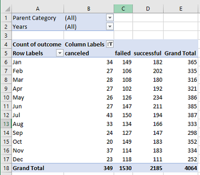
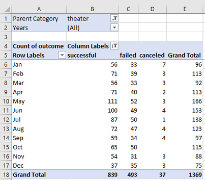
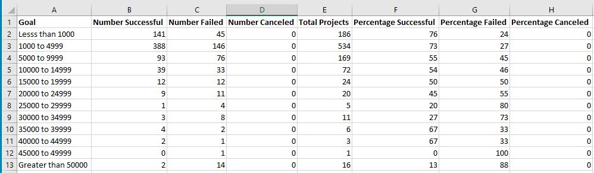
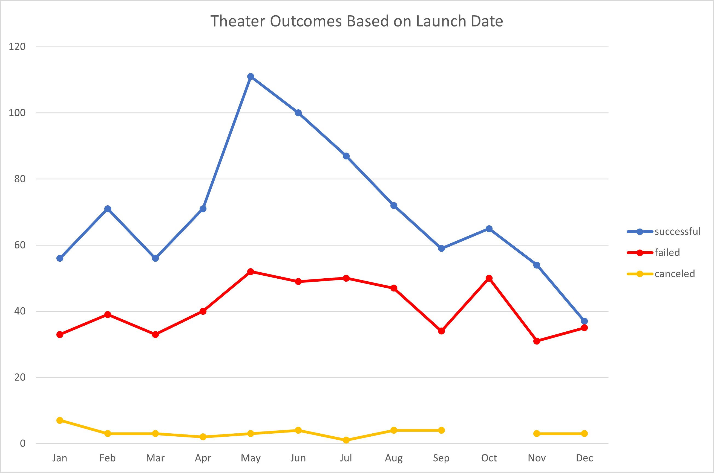
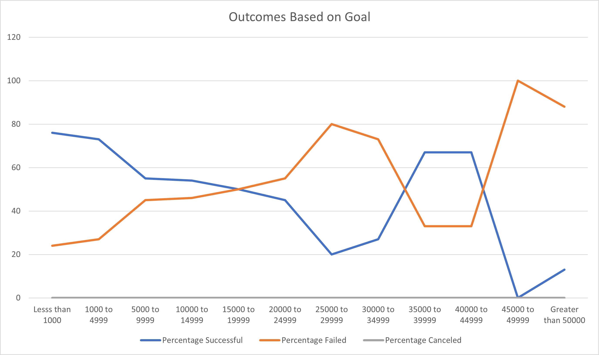

# Analyzing Kickstarter Campaigns with Excel

## Resources
- Data source: Kickstarters.xlsx
- Software: Microsoft Excel Version 2302

## Project Overview

**Use the Kickstarter data to create two new analyses:** 
1. Outcomes based on launch date: Using a pivot table, determine the number of successful, failed, or canceled campaigns, based off of the month that they were launched in.
2. Outcomes based on goal amount. After grouping each campaign into bins using the goal amount, determine the percentages of campaigns that were successful, failed, or canceled. 

## Results & Analysis

For the first analysis, tasks included creating new columns, sheets, pivot tables, filtering the pivot table, and creating a chart from that pivot table. 

 

For the second analysis, tasks included changing the format of data in a column, using a new function: COUNTIFS(), and visualizing percentages using a chart.

## Challenges

A challenge I ran into was learning how to use the new COUNTIFS() function. This was the first time I had used this function and I was unsure what arguments to input into the function. It became easier to understand once I researched how this function operated. However, I was still making errors on my notation so I kept having to go back to edit my arguments.

## Drawing Insights

### What are two conclusions you can draw about the Outcomes based on Launch Date?

If a campaign is launched in the Summer months (May, June, July) then they are more likely to succeed since the count of successful campaigns is higher during that time period. Another conclusion that can be drawn is that canceled campaigns are low and steady all year round at or below 7 counts.

### What can you conclude about the Outcomes based on Goals?

Generally speaking, the lower the goal amount, the higher the success rate. Although there are some instances where campaigns are just as successful, such as in the 35k to 45k range. Also, none of these campaigns were canceled, which was quite surpising to see.

### What are some limitations of this dataset?

This dataset is small with only 4,115 rows, so there is not much information. This dataset mainly tells the viewer if a campaign was successful, if they failed, or if they were canceled. However, I believe the data served its purpose regarding both analyses.

### What are some other possible tables and/or graphs that we could create?

We could create graphs using different filters for the parent category and subcategory instead of looking at just "Theatre" for the parent Category and "plays" for the subcategory. We could also take a look at the percentage funded and the average donation to see if they have any impact on the outcome of a campaign (successful, failed, canceled).

---

    
Return to the <a href="https://kenlo94.github.io/">Homepage</a>

    
View the Project on <a href="https://github.com/kenlo94/kickstarter_analysis">GitHub</a>

